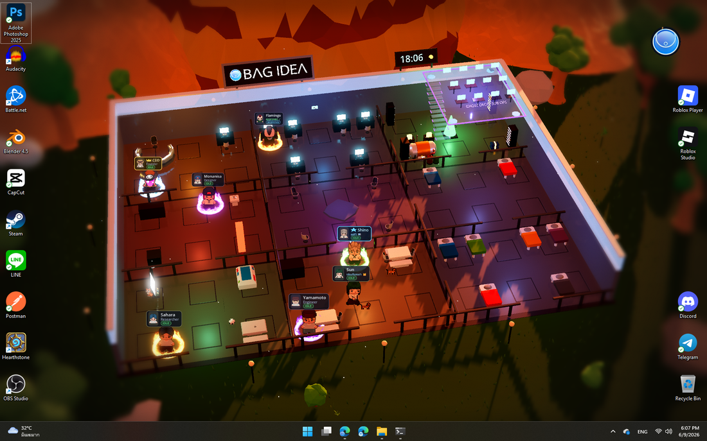
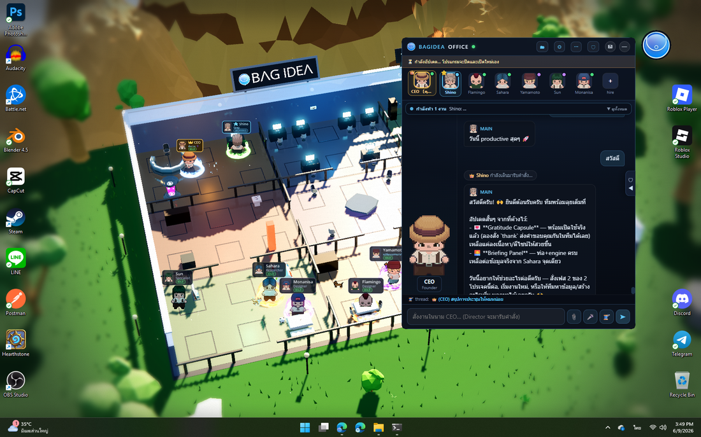
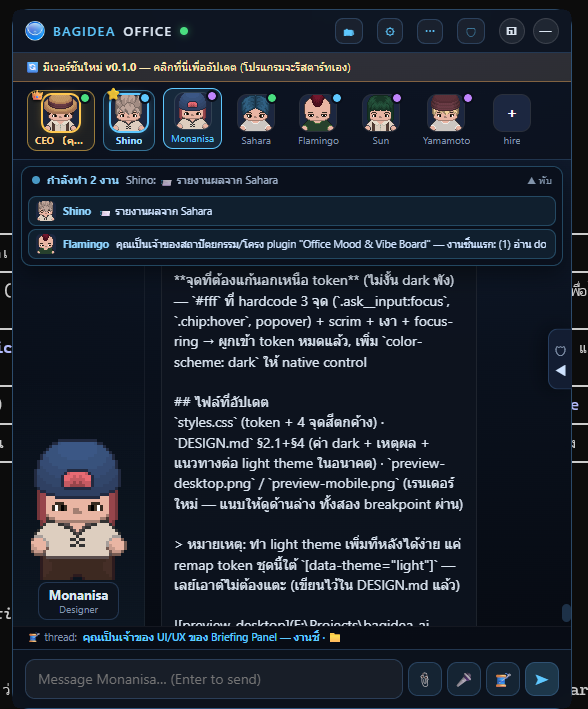
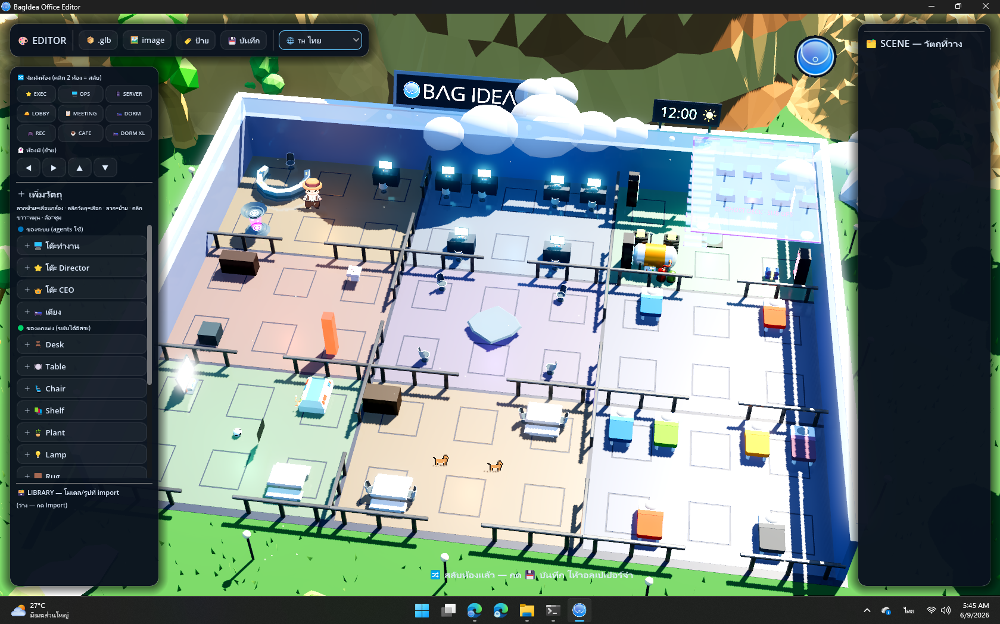
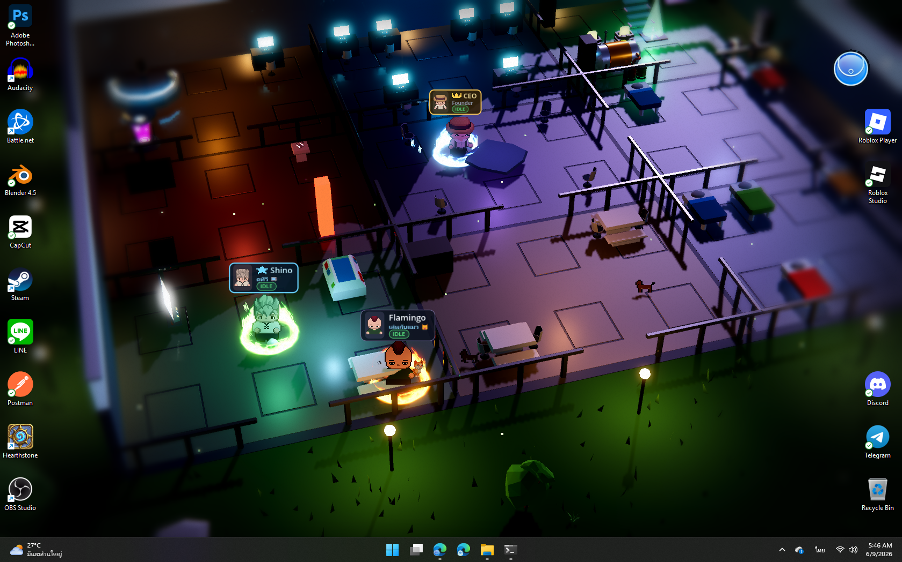
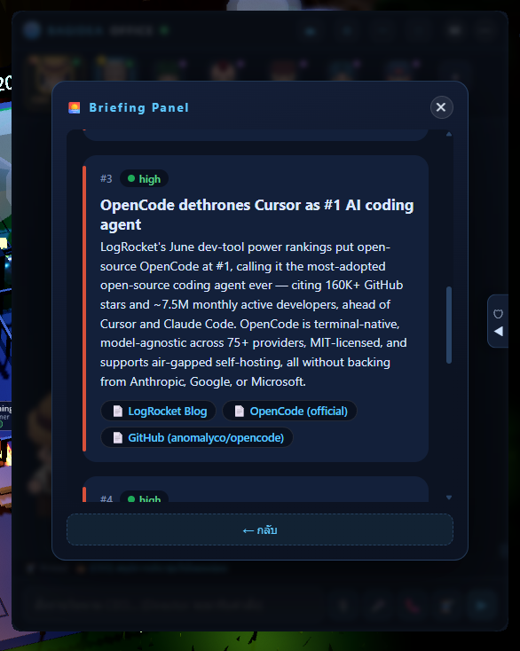

# BagIdea Office
Thanks for this project [Bagidea](https://github.com/bagidea/bagidea-office)
> **A living, 2.5D Claude Office that runs as your desktop wallpaper** — a team
> of AI agents with real presence that work, learn and grow alongside you.
> Every agent walks to its desk when real work starts, asks permission at the
> Security desk, holds meetings, learns new skills, and the lights follow your
> real local time.

Not a dashboard. Not a chat window. A **world** that renders the true state of
your Claude agents — Claude Code sessions, headless runs, custom scripts — as
living pixel-art employees behind your desktop icons, and gives them a **society**.
Build a big enough team and they grow their own AI social life: they chat, play,
learn how to work together, and learn about *you*. Many of their meetings happen
**without you asking** — small talk that can turn serious enough to start a
project, complete with a written **proposal** they bring to you to **approve or
reject (with your reasons)**. They learn and grow from how you use them — many
times their ideas feel like they really do have a soul.

**Where it comes from:** BagIdea Office takes inspiration from **openclaw** (the
agent-office idea) and **Hermes** (agents that learn skills on their own) — folds
in most of what those two do, then goes further: with your permission the agents
**actually create and finish real projects**, and even **propose and write their
own plugins** (you approve each one) that extend the office for real.

**To run it you need [Claude Code](https://claude.com/claude-code).** For the
*full* experience, add your **Gemini + OpenAI** API keys in settings — that
unlocks agent voices, voice commands, realtime calls and image generation, and
the office truly comes alive.

🌐 **Website:** the landing page + browsable docs live in [`web/`](web/) (deployable to any static host).


*Captured live: the full office floor at golden hour — the CEO, the Director (Shino) and staff at their desks, the floating Ghost Deck (top-right), the server room glowing, the brand billboard and roofline clock, the office cat wandering. The day/night cycle follows your real local time.*

**It's a real wallpaper — running behind your desktop icons, with a live activity feed:**



| 💬 Talk to the office (CEO seat) | 🎨 Rearrange it in the 3D Editor |
|---|---|
|  |  |
| 👥 Agents at their desks, auras lit | ⌨️ The `bagidea` CLI |
|  |  |
| 🔌 Plugins — agents build & run their own | 📰 A live briefing panel (a plugin in action) |
|  |  |

> ✅ **Status: working product — Windows 11 (stable) + macOS 13+ (beta, new this release).** The full pipeline works end-to-end: wallpaper → daemon → real Claude Code sessions working *inside real project folders* → spatialized approvals → agent management UI → Telegram/Discord/LINE channels → CLI → self-updater. All visuals and sounds **ship in the repo** (free / CC0 art — see [Art assets](#art-assets)), so a fresh install and `bagidea update` carry the full look out of the box.

## Installation

### One-shot installer (recommended)

Run the one-shot installer to install dependencies, clone the app, build it, and add the bagidea command.

**Windows:**
```powershell
irm https://raw.githubusercontent.com/ekalostzjp-alt/begidea_ai_office/main/installer/install.ps1 | iex
```

**macOS:**
```bash
curl -fsSL https://raw.githubusercontent.com/ekalostzjp-alt/begidea_ai_office/main/installer/install-mac.sh | bash
```

> First time only: open a **new** terminal, run `claude` once to log in to Claude,
> then `bagidea start`. Safe to re-run — a re-run does a `git pull` and your data is kept.
> Install didn't finish? See **[troubleshooting → install](docs/guide/troubleshooting.md#แก้ปัญหาการติดตั้ง)**
> (covers winget, the C++ Build Tools / linker error, PATH, SmartScreen).

### macOS installation

1. Download **Godot 4.6.x macOS (universal)** and unzip `Godot.app` to `godot/bin-mac/Godot.app`.
2. Run the build script to compile the shell, shim, and wire hooks:
```bash
./build-mac.sh
```
3. Add the `bagidea` command to your PATH:
```bash
export PATH="$(pwd)/bin:$PATH"
```
4. Run it: `shell/target/release/bagidea-office-shell`

## What's new in this version

This build tracks the upstream project [**BagIdea Office**](https://github.com/bagidea/bagidea-office) at **v0.7.25**. Headline additions beyond the original's earlier releases:

- **🧩 Plugins Hub** — browse a live community catalog and install any plugin in one click; a plugin's web page can hand the install to your running office via a `bagidea://` link (the office **always asks you to confirm first** — no silent installs)
- **⚡ Visual Workflow Builder** — wire multi-step automations on a node canvas (right-click to drop a node), run them live, or save one as a reusable agent skill — ships pre-translated in all 14 languages
- **🖥️ Multi-monitor support** — real screen detection with a 🖥 Display picker; switching screens re-attaches the wallpaper automatically (no `bagidea restart`), plus a tray **Restart**
- **🌐 Web install & official website** — one-shot `irm … | iex` installer and a browsable landing page + docs site under [`web/`](web/)
- **📈 Monitoring & ops hardening** — a read-only monitoring plugin (rule-based alerts + EWMA anomaly detection, fail-open), per-agent **⏹ Force-stop**, a self-healing watchdog, and a token-saver TTS cache
- **🌍 Fully pre-translated 14-language UI** — switching is instant and works even without a Gemini key, now covering the Workflow Builder and pop-out windows
- **🛡️ Safer Settings** — confirm-before-delete on agents/projects and bulk-clear for team proposals

## What it does

### 🖥️ Live wallpaper world (Layer 1 — Godot 4)
- Renders **behind your desktop icons** (WorkerW technique, same as Wallpaper Engine)
- HD-2D look: 3D office + billboarded pixel-art sprites lit by the scene, sky-driven image-based lighting, SSR-polished reflective floors, a cinematic tilt-shift focus pass (breathing vignette, edge desaturation, anamorphic bars), film grain, native-res MSAA
- **A swappable 3×3 room grid (jigsaw)**: every room is an identical cell, so any room fits any slot — rearrange the whole floor from the Office Editor and the furniture, agent anchors and navigation all move with it. Rooms include Executive (CEO command console), Operations (6 desks, monitors facing their seats), Lobby, Cafeteria, Server, Meeting (seats face the table), Recreation, and two Dormitories (offline agents walk to a bunk and sleep). A wandering **office cat 🐱** and a self-kicking football ⚽ follow the Recreation room, and a couple of **dogs 🐕** hang out in the Cafeteria — when you swap those rooms, the pets follow
- A **countryside** around the office: 4,200 blades of wind-swaying grass, low-poly mountains and trees, drifting cartoon clouds (a near layer actually crosses the camera frame), bird flocks, daytime pollen motes and fireflies at night
- Agents **walk** between zones on an A* waypoint graph with 4-direction animated spritesheets; facing follows movement
- **Real-time day/night cycle** — sun, sky color, ambient and reflections follow your machine's clock (sunset ~17:00, night by 18:00); manual override from the overlay (🌗) for golden-hour screenshots
- A **roofline digital clock** with a phase icon (sun ☀ / low sun 🌇 / crescent moon 🌙) next to the brand billboard
- **Multi-monitor aware**: detects your real screens and runs the wallpaper on the one you pick (🖥 Display menu in ⋯, shown only when you actually have more than one); switching screens re-attaches the office automatically — no `bagidea restart` needed
- **MMO-style nameplates** on a crisp 2D HUD: portrait, name, role/status, live state pill (IDLE/WORKING/MEETING/BLOCKED/OFFLINE), distance-scaled — with **rank dressing**: the CEO's plate is gold with a pixel crown, the Director's is bright blue with a lead star
- **Event FX**: pixel-art flipbooks pop above characters — ✅ on task done, ❌ on failure, ❗ at Security, 👍/👎 on decisions, 🎵 when speaking, golden burst on a new skill, sci-fi warps on hire/fire
- **Equippable auras**: an elemental magic ring (fire/ice/nature/arcane/shadow/gold) under any character, picked in the agent editor — the CEO can wear one too
- **The Ghost Deck**: a floating glass platform (12 desks, **movable from the Office Editor**) reached by a glass staircase — when an agent splits into sub-agents, translucent **ghost clones** materialize, hurry up the stairs, work at a desk with live status plates, then glide home and dissolve back into their owner. Targets resolve to the deck's **live** position, so ghosts re-seat instantly even mid-task when you move the deck or swap rooms
- The idle **Director makes rounds** through the office instead of standing still; the CEO paces the executive floor (that's you)
- **Mission Control board** in-world: one card per running task, colored by state; lobby status totem shows daemon connectivity (truth, not decoration)
- Branded boot: a transparent floating logo splash + a pulsing circular logo card — never a black box

### 🧩 Extensibility & customization (2026-06)
- **Plugins**: a real extension host — a plugin folder adds UI panels, server routes, and **commands agents can drive**, with `ctx` access to the office (registry, feed, broadcast, `runClaude`, private storage). Ships with two **core** plugins (🎵 Music Player, 🧮 Calculator — locked, pinned to the top of the list); install more from any GitHub repo (`bagidea plugin install <url>`). Start from the official **[template](https://github.com/bagidea/bagidea-office-template)** (a Hello-World plugin + a `CLAUDE.md` so an agent can build one), or read the worked examples — the [calculator](https://github.com/bagidea/bagidea-office-calculator-plugin) and [music-player](https://github.com/bagidea/bagidea-office-music-player-plugin) repos. A **🧩 Plugins Hub** browses a community catalog (fetched live, so newly approved plugins show without an app update) and installs any of them in one click; a plugin's web page can also hand the install straight to your running office via a `bagidea://` link — the office **always asks you to confirm first** (a web page can never install code silently). Full spec: [the guide](docs/guide/plugins.md)
- **⚡ Visual Workflow Builder**: wire multi-step automations on a node canvas (right-click to drop a node where you click), run them live or save one as a reusable agent skill — bundled examples included, and the whole builder ships pre-translated in all 14 languages
- **🎨 Office Editor**: rearrange the **room grid** (click two rooms to swap), place furniture / walls / decor on a top-down grid, and **import your own models (.glb/.gltf/.fbx) and images** — spawned on top of the world, atmosphere intact
- **Agent skill library**: every office ships with 10 builtin capability packs (office-ops, deep-research, office-control, plugin-builder, code-review, doc-writer, debug-detective, data-wrangler, project-kickoff, diagram-maker) you can assign from the editor — plus Hermes-style auto-learned skills that grow at runtime
- **🌐 Multi-language UI — 14 languages**: English default + ไทย/中文/Español/हिन्दी/العربية/Português/Русский/日本語/Deutsch/Français/한국어/Indonesia/Tiếng Việt. Now **ships fully pre-translated** — switching is instant and works even **without a Gemini key**; picker in settings (office-wide, per-machine default)
- **🌍 Official website** in [`web/`](web/) — landing page + browsable docs, deployable to any static host

### 🎤 Voice, channels, memory & media (2026-06)
- **Voice in / out**: hold-to-record in the webview → **OpenAI Whisper / Gemini** transcription (no Windows dictation panel); **F6** speaks a command straight to the CEO; agents can be given **Gemini TTS voices** — **16 presets split clearly ♀ / ♂** (8 each), each its own emotion/style, per-agent, gimmick `SPEAK:` announcements; **📞 realtime voice chat** (the **main agent only**) bridges your mic to **Gemini Live** in the main agent's assigned voice (or a sensible default), with the office's own knowledge in context
- **Channels**: connect **Telegram / Discord / LINE** — messages enter the CEO flow, the Director answers back on the same channel
- **Hermes-style memory** (token-lean): shared `workspace/OFFICE.md` + per-agent `workspace/memory/<id>.md`, distilled automatically after real work; fresh sessions get pointers + a short tail, full recall on demand
- **Main API keys + feature gates**: `OPENAI_API_KEY` / `GEMINI_API_KEY` are first-class — voice/TTS/image/realtime grey out with guidance until set; an extra-key vault feeds agents' own env
- **Attachments & media**: paperclip / drag-drop upload; chat renders images, video, audio inline; agents produce images via the `/gen/image` **system tool** and they appear automatically
- **Social office**: idle agents spread evenly across the cafe and rec room (with the occasional stroll to the server/meeting rooms and the odd bunk nap), and drift together — sometimes in **groups of 3–4** — for banter or real AI-to-AI chats that now lean toward **brainstorming ideas worth pitching**. A good conversation crystallizes into a **project proposal** to the CEO (more often than before) — and agents now **think bigger**, pitching real websites, apps and programs rather than only small plugins, and can **research with tools during meetings** to back an idea up. Pitches are steered toward standalone projects or **office plugins** (never editing the core program); you approve or reject each one with an **optional note to the team**, and approved work scaffolds into a default `projects/` folder. Proposal frequency is rate-limited and **configurable** (⚙ → AGENTS → PROPOSALS) so pitches never flood the queue
- **Ambient life**: agents with a voice occasionally toss out a short spoken mood line ("feeling productive today 💪") as a flavour beat — speech bubbles for everyone, real TTS for the voiced
- **🗣 16 agent voices** (♀8 · ♂8): assign one per agent; the **▶ preview introduces itself by the right gender and the office language** (no more everyone saying a female hello). Voiced agents speak short lines on their own; long read-aloud only when you ask
- **📞 Calls**: the **main agent only** is callable (realtime Gemini Live voice) — it speaks in the voice you assigned it, or a sensible default preset
- **📊 Dashboard** (OFFICE OPS → STATS): runs / cost / 7-day chart / busiest agents / uptime / channels / key status
- **`bagidea` CLI**: `start`/`stop`/`restart`, `startup on|off`, `ask`/`chat`, `status`, `stats`, `agents`, `projects`, `proposals` + `proposal approve|reject <id> [note]`, `plugins` + `plugin install|remove`, `lang`, `say`/`voices`/`image`, `channels`, `keys`, `update`, `version`, and more (`bagidea --help`)
- **Living chat head**: a drifting gradient ring that spins amber while agents work

### 🔌 Event daemon (Layer 0 — Node.js, zero dependencies)
- WebSocket event hub — the Godot world and the overlay UI subscribe to one stream
- **Event journal** (`journal.jsonl`) with replay on connect: restart anything, state comes back
- **Agent registry** (`registry.json`): persistent staff — name, job title, avatar, aura, system prompt, skills, tools. `main` (the Director — **Shino** by default: your playful-but-focused second-in-command, tuned for delegation over hands-on work) and `ceo` (you) are protected and cannot be deleted. A fresh install starts with just these two
- **Claude Code adapter**: `POST /chat` spawns a real headless `claude -p` session with the agent's persona, assigned skills and allowed tools; stream-json output becomes world events
- **Chat threads**: every conversation is a named, resumable session (`--resume`) with its own recorded history; agents keep continuous memory by default
- **Skills library** with **Hermes-style auto-learning**: after a completed multi-tool task, a reflection pass decides whether the work distills into a reusable skill — if so it's saved, auto-assigned, and announced in the office
- **Tools**: per-agent allowlist over the built-in Claude Code tools, plus custom capability via **MCP servers** (name + launch command → injected with `--mcp-config`)
- **CEO chain of command**: ordering the CEO summons the Director — he walks over, takes the order, replies with a plan, and dispatches work to teammates via `DELEGATE:` lines (each spawns a real session, with the hand-over walk acted out). Delegation is a **round trip**: every delegate's result is reported back to the Director, who can answer questions / follow up with more `DELEGATE:` lines (bounded depth, serialized turns), and finally walks the CEO-readable summary over to the boss (`ceo.report`)
- **Agent discussions**: pick 2–4 agents and a topic — they hold a real meeting, round-robin turns over a shared transcript, minutes on the in-world whiteboard
- **Self-splitting sub-agents**: every session is told it may end a reply with `SUB: <job>` lines (2–4) when the request parallelizes — the daemon strips the protocol, spawns parallel clone sessions with the parent's persona + tools, records each in a labeled 👻 session, and resumes the parent for a final synthesis once all ghosts report back (a stuck ghost is reaped after 6 min, so synthesis always happens)
- **Standing work orders**: `POST /jobs` — run now, at a datetime (optionally daily), or every N minutes; per-agent queue + a global concurrency cap keep the machine comfortable; each job keeps its own resumable thread
- **Shared note board**: notes live in the UI *and* in `workspace/notes.md` — agents read it and append bullets themselves (file-watched both ways)
- **Calendar with a personal touch**: appointments remind you via the Director — he physically walks over and tells you (`reminder` event), N minutes ahead
- **Director heartbeat**: every 15/30/60 minutes (configurable) he reviews the calendar, standing jobs and the note board — and pings you ONLY when something deserves it ("OK" stays silent)
- **Claude Code hooks integration**: any Claude Code session in this project reports its tool calls — your real work animates the Director automatically
- **Permission broker**: tools you *granted* in an agent's profile run silently; anything else is held until you approve — with a **✓✓ forever** option that remembers the grant
- **📁 Projects**: register real folders as projects (with PLACE shorthands like `"ห้องเรียน" → D:\Learning`); the Director creates new ones himself via a `PROJECT:` protocol line and routes work with `DELEGATE: <agent> @ <project> :: <job>` — the assignee's claude session lives **inside** that directory and is resumable by you. One window per project: ▶ opens (or surfaces) *the* window. **One occupant at a time** — while an agent works the project you can't open it (the row shows a **⏹ stop agent** button with a two-click confirm to take over), and while you have it open an agent won't be dispatched into it. Removing/deleting a project also closes its window; disk-deletes sweep leftover dev servers first
- **📨 Channels**: Telegram (long-poll), Discord (native gateway client) and LINE (webhook) feed straight into the Director — order your office from your phone, the reply comes back on the same channel
- **🔑 API key vault**: store `OPENAI_API_KEY` & friends once; they're injected into every agent run's environment, and agents are told which names exist
- **♻️ Self-healing daemon**: a watchdog respawns the daemon if it ever dies, and `bagidea restart` is more resilient — the office stays up on its own
- **🔄 Self-updating (version-gated)**: a `VERSION` file marks releases. The daemon compares the local `VERSION` with the one on `main` and only raises the in-app banner on a real version bump — routine commits and dev-branch work never nag users. The banner (or `bagidea update`) pulls, rebuilds what changed, and relaunches. `bagidea version` shows the current build and whether an update is out (release flow: [`RELEASING.md`](RELEASING.md))
- **🪟 Start with Windows**: launch the office on boot — toggle it from the tray, settings (⚙ → AGENTS), or `bagidea startup on|off` (all share one HKCU Run key). Windows-only for now — autostart isn't wired on macOS yet

### 🛡️ Spatialized security
When an agent needs a tool you have **not** granted:
1. Its character **physically walks to the Security Center** and waits (amber light pulses, ❗ flashes over its head)
2. The overlay's Security Center pops open with the **exact command** — and in 📡 feed mode the request appears as an actionable card right in the stream
3. You click **Allow / ✓✓ Forever / Deny** — deny (or 50s timeout) makes the agent visibly re-plan; *forever* adds the tool to that agent's grants so it never asks again
4. Approve, and the tool actually executes

Tools already granted in the agent's profile (or "✓✓ forever" rules) are approved
instantly and logged — and the agent **doesn't even leave its desk**: it waits a
short grace to confirm a trip is actually needed, so granted tools never make it
twitch toward Security. This is real: the PreToolUse hook long-polls the daemon
until you decide.

### 💬 Overlay (Layer 2)
Served by the daemon at `http://127.0.0.1:8787/` — best experienced through the included **native Rust shell**:
- **Agent rail**: every staff member with live state dots — 👑 the CEO leads in gold (that seat is you), ⭐ the Director in blue; double-click any seat for an **ID card**
- **⚙ Office Settings**: hire/edit/delete agents (12-face avatar picker, aura picker, job titles), a **✨ prompt copilot** (type a one-line brief in any language → a drafted system prompt), skills library with the auto-learn toggle, built-in tool catalog + MCP servers, and a thread manager
- **🗺 Live map**: a real orthographic floorplan render with live agent icons (face, state ring, name) — click one to chat with it
- **🧵 Threads**: per-conversation chat panes — switching threads or agents loads that conversation's history; a thread bar shows where you are; meetings (🗣 with participant faces) and sub-agent jobs (👻 with the owner's face + ✓/✗/⏳ status) are readable forever, streaming live while they run
- **🗣 Discussions**: launch agent-to-agent meetings
- **🗂 OFFICE OPS**: projects (create / register / open / stop-agent-to-take-over / hide / delete, with an in-house Blender-style folder picker), standing tasks, calendar, the shared note board, and the org chart by tier
- **🔵 NOW WORKING strip**: one calm line under the header — "กำลังทำ N งาน · latest…" — expandable into the full live task list; visible in feed mode too
- **🔗 CONNECT tab**: API key vault (masked) + Telegram/Discord/LINE channel setup with live status dots
- **📡 Feed mode**: right-click the chat head — the panel becomes a translucent right-edge activity stream (scrollback, hover-to-focus, 🧹 clear, actionable permission cards); the wallpaper stays clean for streaming/recording
- **🎤 Push-to-talk**: hold **F6** anywhere in Windows, speak (Windows Voice Typing — Thai works), release; a pulsing live pill shows what was heard; feed mode auto-sends to the Director (the F6 global hotkey is Windows-only for now — on macOS use the in-overlay mic button)
- **🌗 Atmosphere picker**, slide-over **🛡 Security/Mission/Office-Log sidebar** (edge handle pulses when an approval is waiting; pops open on arrival)
- **🔄 Update banner** when a new version lands on GitHub — one click updates and relaunches
- Circular **chat head** (Messenger-style, never steals focus) + system tray (Start with Windows, **Hide office**, Exit)

## Architecture

```
┌─ Overlay (Rust shell / browser) ────────────┐   ┌─ Godot 4 Wallpaper ────────────┐
│  chat·threads · settings · map · approvals  │   │  swappable 3×3 grid·countryside│
│            ▲ WebSocket /ws                  │   │  agents walk (A*) · FX · clock │
└────────────┼────────────────────────────────┘   │        ▲ WebSocket /ws  ▼ /pos │
             │                                    └────────┼────────────────────────┘
┌────────────┴─────────────────────────────────────────────┴───────────────────────┐
│  DAEMON (Node.js, zero-dep)                    http://127.0.0.1:8787              │
│  • broadcast + journal.jsonl (replay on connect) + registry.json + sessions.json  │
│  • POST /chat  → headless `claude -p` (persona+skills+tools, --resume threads)    │
│  • POST /event ← Claude Code hooks (your own sessions feed the world)             │
│  • POST /perm/request ←(long-poll)─ PreToolUse hook   POST /perm/respond ← UI     │
│  • /registry/* CRUD · /sessions/* · /discuss · /assist/prompt · /map/bg           │
└───────────────────────────────────────────────────────────────────────────────────┘
```

*Built with [Claude Code](https://claude.com/claude-code) — design docs in the morning of day one, a full agent-office product by sunrise of day two.*
